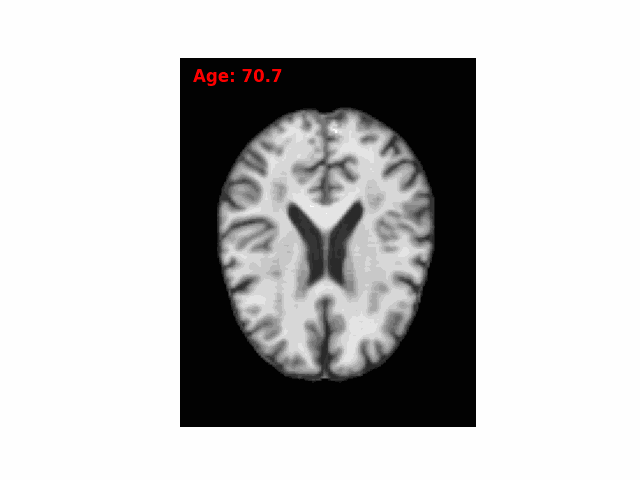

<h4 align="center">CLIMB: Controllable Longitudinal Brain Image Generation via Mamba-based Latent Diffusion Model</h4>


## Table of Contents
- [Training](#training)
- [Inference](#Inference)
- [Pretrained models](#pretrained-models)
- [Acknowledgements](#acknowledgements)


## Training
-----Train models------
Step1: Train autoencoder model
```console
python train_autoencoder.py 
```
Step2: Extract latent features
```console
python extract_latents.py
```
Step3: Train diffusion model conditioned on variables (age, gender, disease, status, biomarker,...)
```console
python train_diffusion_variables.py
```
Step4: Train diffusion model with all conditional factors (variables and image features)
```console
python train_diffusion_image_features.py
```
Step5: Train IRLSTM model (for predicting brain volumes structure and disease status at the projected age)
```console
python train_irlstm.py 
```

## Inference

Evaluating Model
```console
python measure_performance.py 
```
Inference
```console
python inference.py 
```

Running the program looks like this:




## Pretrained models

Download the pre-trained models for CLIMB:

| Model                  | Weights URL                                                  |
| ---------------------- | ------------------------------------------------------------ |
| Autoencoder            | [link](https://drive.google.com/file/d/1FOcgpHFv7jDSXelM34LF5A9Vgn1JEB0h/view?usp=drive_link) |
| Diffusion on variables | [link](https://drive.google.com/file/d/1bQu_jqSw_l_KsB2DwXkD459J7GPUwFqJ/view?usp=drive_link) |
| Diffusion on all data  | [link](https://drive.google.com/file/d/1eJpfaNU7-eRpuCJZ_8JCrGc5xj7Q91mS/view?usp=drive_link) |
| IRLSTM                 | [link](https://drive.google.com/file/d/1sA8iDYge7YMJn8tnqOwNkYddcyQavZ-A/view?usp=drive_link) |

## Acknowledgements

We thank the above repositories for their contributions and resources 
[MONAI](https://monai.io/) and its [GenerativeModels](https://github.com/Project-MONAI/GenerativeModels/tree/main) extension.
[BrLP](https://github.com/LemuelPuglisi/BrLP)


